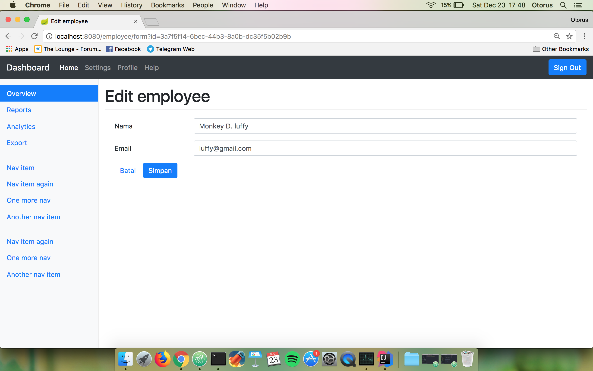

# Crud Employee Spring Boot  []

#### Untuk menjalankan : `mvn spring-boot:run`

Access Local: `http://localhost:8080/login`

 - Demo Heroku : https://crud-employee.herokuapp.com/
 - Username: didik
 - passwwd: 123
    

Login Home

Login Admin Home

Daftar Emlployee

Form Edit Employee

Cari Employee
