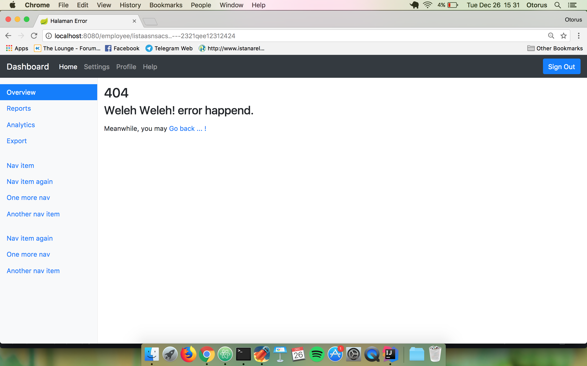

# Crud Employee Spring Boot 

#### Untuk menjalankan :
`mvn spring-boot:run`

Access `http://localhost:8080`

Demo heroku : `https://crud-employee.herokuapp.com/`
username : `didik`
passwd  : `123`

Login Home

Login Admin Home

Daftar Emlployee

page 404

Form Edit Employee

Cari Employee
